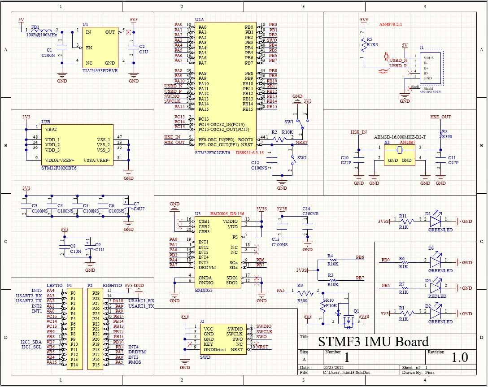
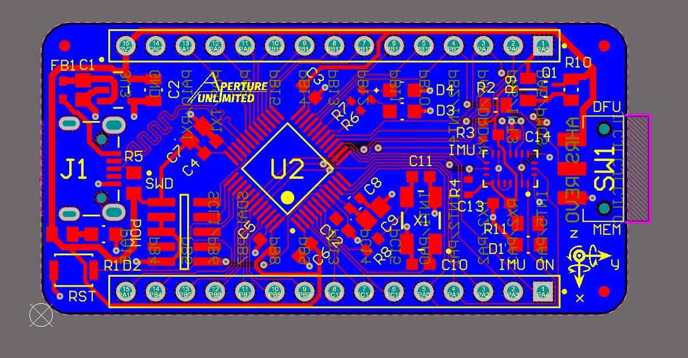
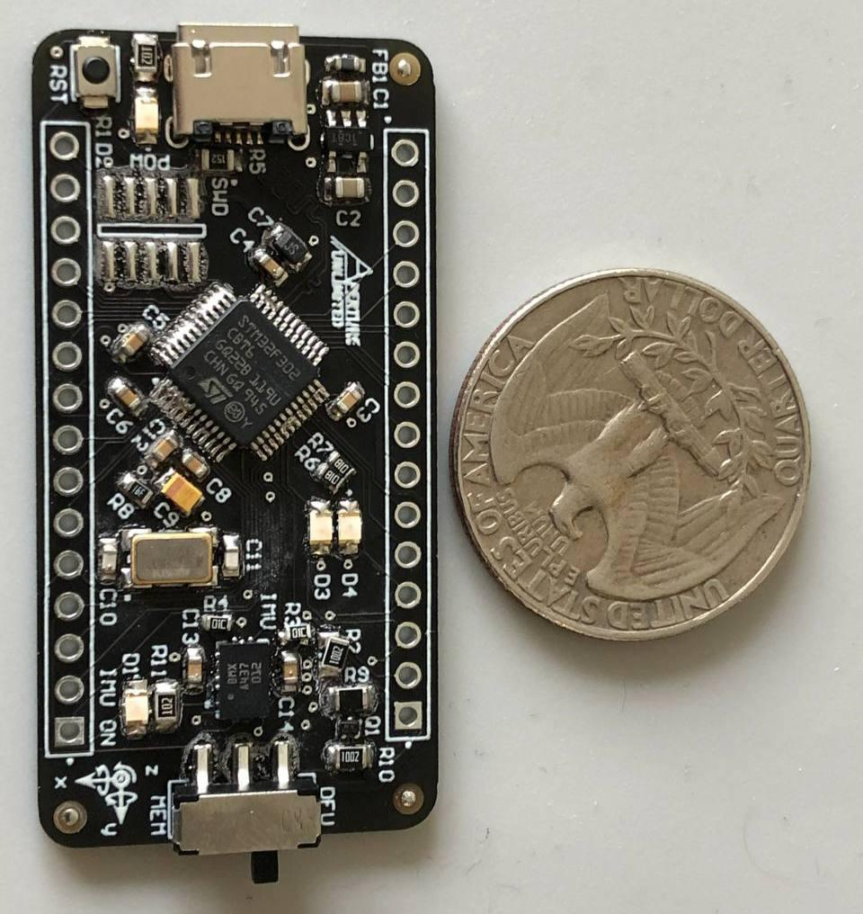

# ahrs_board
Firmware for my AHRS PCB. Uses a modified version of a build system developed by PyroAVR for STM32Lxxxx MCUs (see BUILD.md).
Work in progress! :^)

## Schematic

## PCB
Designed with Altium.

## Soldered
I don't know why I made it this small...
(It still had a few shorts in this image)

